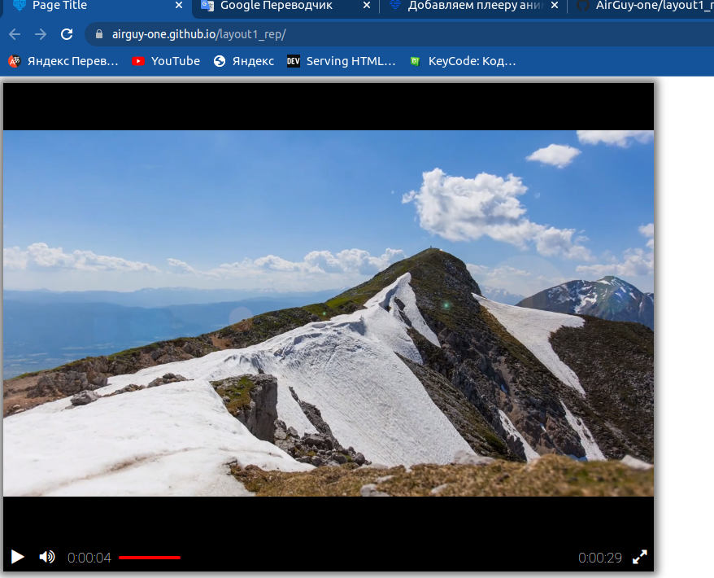

# Видеоплеер в браузере


## Чтобы запустить проект локально, нужно:
1. Запустить сервер командой
```shell
python3 server.py
```
2. Открыть страницу в браузере с адресом (http://127.0.0.1:5500/#)

Ссылка на демо-версию сайта: https://airguy-one.github.io/layout1_rep/